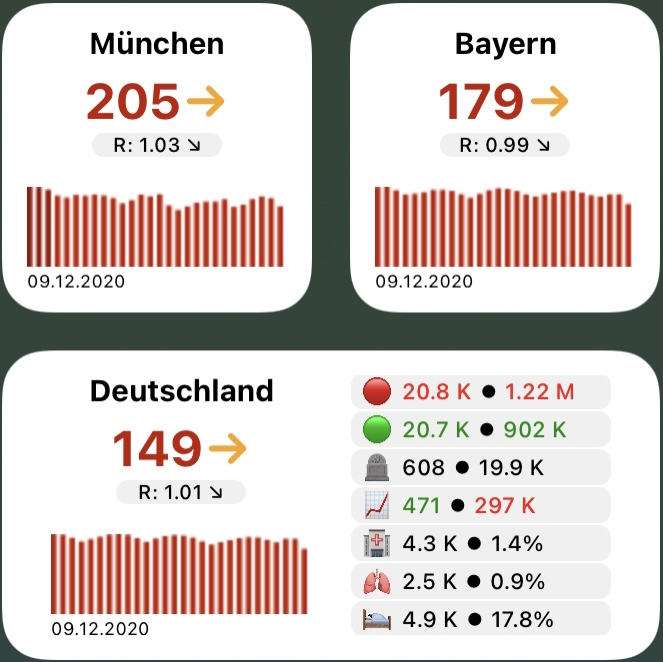

# Beschreibung

COVID-19-Widget für [Scriptable](https://scriptable.app) und iOS/iPadOS.

Das Widget zeigt Informationen wie Inzidenzwert und seinen Verlauf, die Anzahl der Neuinfizierten oder den R-Faktor innerhalb Deutschlands an.
Das Widget kann per Parameter so eingestellt werden, dass die Zahlen für einen bestimmten Landkreis, ein bestimmtes Bundesland oder Deutschland angezeigt werden. Außerdem kann ein eigener Name für Landkreis oder Bundesland eingestellt werden.

Grundlage ist das [incident-Widget von tzschies](https://github.com/tzschies/incidence). Mit der Variante von diesem Fork wurden nur geringfügige Anpassungen und kosmetischen Änderungen vorgenommen.

# Installation

Source
- Quellcode <b>corona.js</b> in [Scriptable](https://scriptable.app) als neues Script hinzufügen.
- Widget hinzufügen und über Parameter konfigurieren (siehe Abschnitt unten).

# Konfiguration über Parameter

Parameter werden über eine kommaseparierte Liste übergeben wie folgt:

Gebiet, [LAT, LON, Name]

Erklärung:

- Gebiet
  - 0: Landkreis
  - 1: Bundesland
  - 2: Deutschland
- LAT: Breitengrad (optionaler Parameter)
- LON: Längengrad (optionaler Parameter)
- Name: Eigene Bezeichnung des Landkreises/Bundeslands (optionaler Parameter)

Beispiele:
- lokaler Landkreis (Ortung via GPS): ""
- lokales Bundesland (Ortung via GPS): "1"
- fest eingestelltes Bundesland Bayern: "1,48.96,12.38"
- fest eingestellter Landkreis Regensburg mit eigenem Namen: "1,48.96,12.38,LK Regensburg"
- Deutschland: "2"

# Angezeigte Informationen

Als Widget in Größe Small werden folgende Informationen angezeigt: 
- Inzidenz mit Trendpfeil.
  - Der Trendpfeil bestimmt sich durch den geschätzten R-Faktor. Der R-Faktor soll die Zahl derer angeben, die von einem Infizierten angesteckt werden. D.h. ein R-Faktor von 2 bedeutet, dass ein Infizierter im Durchschnitt 2 weitere Menschen ansteckt. Der R-Faktor wird unter der Annahme geschätzt, dass zwischen Ansteckung und dem Risiko, selbst andere anzustecken, im Durchschnitt 3,5 Tage vergehen. Außerdem werden die durchschnittlichen Neuinfizierte über 7 Tage gemittelt (um statistische Effekte am Wochenende zu eliminieren). Dies ist nur eine grobe Schätzung, um die ungefähre Dynamik der Pandemie anzugeben und den Trend zu bestimmen!
  - Beispiel zur Berechnung: Vor 7 Tagen gab es im 7-Tage Schnitt 4 Neuinfektionen. Heute gibt es im 7-Tage-Schnitt 16 Neuinfektionen. Unter der Annahme der 3,5 Tage und einem R-Faktor von 2 haben die 4 Neuinfektionen nach 3,5 Tagen also 8 Personen angesteckt, welche nach weiteren 3,5 Tagen 16 Personen angesteckt haben. Der R-Faktor berechnet sich dann wie folgt:
    - R = Wurzel(Neuinfektionen_heute/Neuinfektionen_vor_7_Tagen) = Wurzel(16/4) = 2
  - Der Trendpfeil ergibt sich also aus dem R-Faktor. Ist dieser
    - zwischen 0,95 und 1,05, so bleibt die Inzidenz in etwa konstant (→),
    - ist er zwischen 1,05 und 1,1 steigt die Inzidenz leicht (↗︎),
    - über 1,1 steigt sie stark (↑),
    - zwischen 0,9 und 0,95 sinkt die Inzidenz leicht (↘︎),
    - unter 0,9 sinkt sie stark (↓).
- Geschätzter R-Faktor mit Trendpfeil.
  - Der geschätzte R-Faktor wird angezeigt, nach der Berechnung wie oben beschrieben. Für diesen gibt es ebenfalls einen Trendpfeil. Dieser vergleicht den geschätzten R-Faktor von heute mit dem Wert von gestern:
    - →: Die Werte von heute und gestern sind gleich.
    - ↗︎: Der Wert von heute ist größer als der Wert von gestern.
    - ↘︎: Der Wert von heute ist niedriger als der Wert von gestern.
- Graphischer Verlauf der Inzidenz in den letzten vier Wochen.
- Datum der letzten Aktualisierung der Daten beim RKI.

Als Widget in Größe Medium werden auf der rechten Seite weitere Informationen für die jeweilige Region (Landkreis/Bundesland/Deutschland) angezeigt: 
- 🔴
  - COVID-19-Fälle im Vergleich zum Vortag. Ist diese Zahl größer Null, wird sie rot eingefärbt. Ist sie kleiner Null, wird sie grün eingefärbt.
  - Die Gesamtzahl der Fälle
- 🟢
  - Neugenesene am heutigen Tag
  - Die Gesamtzahl der Genesenen
- 🪦
  - Neue Todesfälle am heutigen Tag
  - Die Gesamtzahl der Todesfälle
- 📈
  - Aktive Fälle von heute im Sinne von Neuinfizierte minus Neugenesene minus Todesfälle. Ist diese Zahl größer Null, wird sie rot eingefärbt. Ist sie kleiner Null, wird sie grün eingefärbt.
  - Die Gesamtzahl der aktiven Fälle
- 🏥
  - Anzahl der COVID-19-Patienten, die im Krankenhaus behandelt werden
  - Der relative Anteil zu den aktuell Infizierten
- 🫁
  - Anzahl der COVID-19-Patienten, die im Krankenhaus beatmet werden
  - Der relative Anteil zu den aktuell Infizierten
- 🛌
  - Anzahl freier Intensivbetten
  - Der relative Anteil der Gesamtintensivbetten

Zahlenwerte werden wie folgt gerundet und abgekürzt dargestellt:
- 4- bis 6-stellige Werte werden mit "K" gerundet und abgekürzt dargestellt.
  - Beispiel: "123456" wird zu "123 K"
- 7-stellige Werte werden mit "M" gerundet und abgekürzt dargestellt.
  - Beispiel: "1234567" wird zu "1.23 M"
