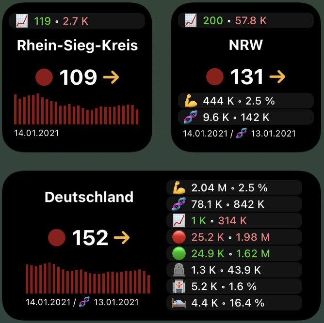
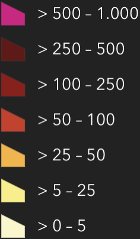

# Beschreibung

COVID-19-Widget für [Scriptable](https://scriptable.app) und iOS/iPadOS.

Das Widget unterstützt umfangreiche [Statistiken](#statistiken) wie die Anzahl der Neuinfizierten oder Impfzahlen. Es kann über Parameter individuell festgelegt werden, welche Informationen angezeigt werden sollen und welche nicht. Die Daten können für einen bestimmten Kreis, ein bestimmtes Bundesland oder Deutschland angezeigt werden.

Grundlage ist das [incident-Widget von tzschies](https://github.com/tzschies/incidence). Auch wird [Code von marco79cgn](https://gist.github.com/marco79cgn/b5f291d6242a2c530e56c748f1ae7f2c) genutzt, um [diese API für Impfzahlen](https://rki-vaccination-data.vercel.app) anzufragen und Ergebnisse zu speichern. Zusätzlich wird [Code von rphl](https://github.com/rphl/corona-widget) genutzt, um die Reproduktionszahl für Deutschland anzuzeigen.

# Screenshots

# Installation

Source
- [Quellcode](https://raw.githubusercontent.com/Besenwiesler/corona-widget/main/corona.js) in [Scriptable](https://scriptable.app) als neues Script hinzufügen.
  - Am besten ganzen Quellcode über die Zwischenablage kopieren/einfügen und anschließend sicherstellen, dass jede Zeile erfasst wurde.
- Im iPhone bzw. iPad Widget hinzufügen und über Parameter konfigurieren.

# Konfiguration über Parameter

Parameter werden über eine kommaseparierte Liste übergeben wie folgt:

Region, Breitengrad, Längengrad, Name, Statistikmodus, Statistiken

## Parameter

- Parameter 1: Region
  - `0`: Landkreis
  - `1`: Bundesland
  - `2`: Deutschland
- Parameter 2: Breitengrad (optionaler Parameter, wenn Deutschland als Region in Parameter 1 gesetzt wurde)
- Parameter 3: Längengrad (optionaler Parameter, wenn Deutschland als Region in Parameter 1 gesetzt wurde)
- Parameter 4: Eigene Bezeichnung für die Region (optionaler Parameter)
- Parameter 5: Statistikmodus (optionaler Parameter)
  - `0`: Im kleinen Widget wird der Inzidenzwert und sein graphischer Verlauf angezeigt
  - `1`: Im kleinen Widget werden Statistiken angezeigt
- Parameter 6: Kommaseparierte Liste der Emojis zu den Statistiken, die im Statistikmodus angezeigt werden sollen, siehe auch Abschnitt [Statistiken](#statistiken) (optionaler Parameter)

## Beispiele

- lokaler Landkreis (Ortung via GPS): Keinen Parameter setzen
- lokales Bundesland (Ortung via GPS): `1`
- fest eingestelltes Bundesland Bayern: `1,48.96,12.38`
- fest eingestellter Landkreis Regensburg mit eigenem Namen: `1,48.96,12.38,LK Regensburg`
- Deutschland: `2`
- Für ein kleines Widget im Statistikmodus mit dem Land Nordrhein-Westfalen (kurz NRW), in dem Impfzahlen, freie Intensivbetten und Zeitpunkt des letzten Updates der Daten angezeigt werden: `1,50.94,6.96,NRW,1,🪧💉①②➖🛏🕰`

# Statistiken

## Inzidenz und graphischer Verlauf

Im Widget in Größe Medium links werden folgende Informationen für die jeweilige Region (Kreis/Bundesland/Deutschland) angezeigt. Auch das kleine Widget kann über die Emojis (siehe Parameter 6) so konfiguriert werden, dass die entsprechenden Informationen angezeigt werden.

- 🪧 Name der Region
- 🦠 Inzidenz mit Trendpfeil
  - Der Trendpfeil richtet sich nach der [Reproduktionszahl](https://de.wikipedia.org/wiki/COVID-19-Pandemie_in_Deutschland#Reproduktionszahl) R.
    - Datenquellen:
      - Für Region Deutschland: Reproduktionszahl des RKI (7-Tage-R-Wert), so wie [hier]( https://www.rki.de/DE/Content/InfAZ/N/Neuartiges_Coronavirus/Projekte_RKI/Nowcasting.html) veröffentlicht. Dies ist der Wert, der oft auch in der Presse aufgegriffen wird.
      - Für Kreise und Bundesländer wird ein geschätzter Wert für die Reproduktionszahl verwendet gemäß folgender Formel:
        - `R = Wurzel( Neuinfektionen_heute / Neuinfektionen_vor_7_Tagen )`
    - Berechnung:
      - ↑ ``R > 1,10`` (steigt stark)
      - ↗︎ ``1,05 ≦ R ≦ 1,10`` (steigt leicht)
      - → ``0,95 ≦ R < 1,05`` (in etwa konstant)
      - ↘︎ ``0,90 ≦ R < 0,95`` (sinkt leicht)
      - ↓ ``R < 0,90`` (sinkt stark)
- 📊 Graphischer Verlauf der Inzidenz in den letzten vier Wochen
- 🕰 Datum des letzten Updates des RKI bzw. der Impfdaten des RKI

"Ampel" neben dem Inzidenzwert und der graphische Verlauf sind nach folgendem Farbschema des RKI-Dashboards eingefärbt. Hiervon abweichend wird jedoch ``35`` statt ``25`` als Grenzwert für orangene Farbe verwendet.

## Weitere Zahlen

Über den Inzidenzwert hinaus können die folgenden Informationen für die jeweilige Region (Kreis/Bundesland/Deutschland) angezeigt werden:

- 📈
  - Aktive Fälle von heute im Sinne von Neuinfizierte minus Neugenesene minus Todesfälle. Ist diese Zahl größer Null, wird sie rot eingefärbt. Ist sie kleiner Null, wird sie grün eingefärbt.
  - Die Gesamtzahl der aktiven Fälle
- 🔴
  - COVID-19-Fälle im Vergleich zum Vortag. Ist diese Zahl größer Null, wird sie rot eingefärbt. Ist sie kleiner Null, wird sie grün eingefärbt.
  - Die Gesamtzahl der Fälle
- 🟢
  - Neugenesene am heutigen Tag
  - Die Gesamtzahl der Genesenen
- 🪦
  - Neue Todesfälle am heutigen Tag
  - Die Gesamtzahl der Todesfälle
- 🅁
  - Reproduktionszahl gemäß der [Erklärung oben](#inzidenz-und-graphischer-verlauf).
- 🏥
  - Anzahl der COVID-19-Patienten, die im Krankenhaus behandelt werden
  - Quote im Verhältnis zur Gesamtzahl der aktiven Fälle (📈)
- 🫁
  - Anzahl der COVID-19-Patienten, die im Krankenhaus beatmet werden
  - Quote im Verhältnis zur Gesamtzahl der aktiven Fälle (📈)
- 🛏
  - Anzahl freier Intensivbetten
  - Der relative Anteil der Gesamtintensivbetten
- 💉 (Daten nur für Bundesländer und Deutschland verfügbar, nicht für Kreise)
  - Gesamtzahl bisher verabreichter Impfstoffdosen (Erstimpfung plus Zweitimpfung)
  - Anzahl im Verhältnis zum Vortag
- ① (Daten nur für Bundesländer und Deutschland verfügbar, nicht für Kreise)
  - Anzahl der Personen, die die Erstimpfung erhalten hat
  - Quote im Verhältnis zur Gesamtbevölkerungszahl der Region
- ② (Daten nur für Bundesländer und Deutschland verfügbar, nicht für Kreise)
  - Anzahl der Personen, die auch die Zweitimpfung erhalten hat
  - Quote im Verhältnis zur Gesamtbevölkerungszahl der Region

Zahlenwerte werden wie folgt gerundet und abgekürzt dargestellt:
- 4- bis 6-stellige Werte werden mit "K" gerundet und abgekürzt dargestellt.
  - Beispiel: "123456" wird zu "123 K"
- 7-stellige Werte werden mit "M" gerundet und abgekürzt dargestellt.
  - Beispiel: "1234567" wird zu "1.23 M"

Folgende Emoji sind relevant für eine individuelle Konfiguration des Statistikmodus:
- 📍 Name der Region in kleinerer Darstellung als 🪧
- ➖ Eine transparente leere Zeile für Freiraum im Layout
