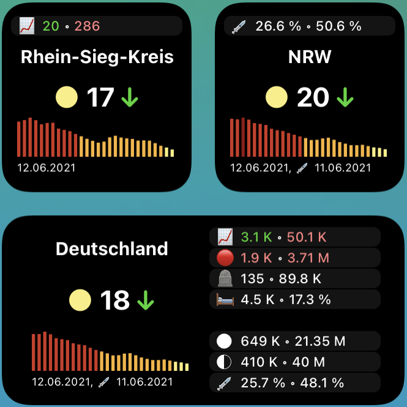

# Beschreibung

COVID-19-Widget für [Scriptable](https://scriptable.app) und iOS/iPadOS.

Das Widget unterstützt umfangreiche [Statistiken](#statistiken) wie die Anzahl der Neuinfizierten oder Impfzahlen. Es kann über Parameter individuell festgelegt werden, welche Informationen angezeigt werden sollen und welche nicht. Die Daten können für einen bestimmten Kreis, ein bestimmtes Bundesland oder Deutschland angezeigt werden.

Grundlage ist das [incident-Widget von tzschies](https://github.com/tzschies/incidence). Auch wird [Code von marco79cgn](https://gist.github.com/marco79cgn/b5f291d6242a2c530e56c748f1ae7f2c) genutzt, um [diese API für Impfzahlen](https://rki-vaccination-data.vercel.app) anzufragen und Ergebnisse zu speichern.

# Screenshots

# Installation

Source
- Quellcode <b>corona.js</b> in [Scriptable](https://scriptable.app) als neues Script hinzufügen.
- Widget hinzufügen und über Parameter konfigurieren.

# Konfiguration über Parameter

Parameter werden über eine kommaseparierte Liste übergeben wie folgt:

Region, Breitengrad, Längengrad, Name, Statistikmodus, Statistiken

## Parameter

- Parameter 1: Region
  - `0`: Landkreis
  - `1`: Bundesland
  - `2`: Deutschland
- Parameter 2: Breitengrad (optionaler Parameter, wenn Deutschland als Region in Parameter 1 gesetzt wurde)
- Parameter 3: Längengrad (optionaler Parameter, wenn Deutschland als Region in Parameter 1 gesetzt wurde)
- Parameter 4: Eigene Bezeichnung für die Region (optionaler Parameter)
- Parameter 5: Statistikmodus (optionaler Parameter)
  - `0`: Im kleinen Widget wird der Inzidenzwert und sein graphischer Verlauf angezeigt
  - `1`: Im kleinen Widget werden Statistiken angezeigt
- Parameter 6: Kommaseparierte Liste der Emojis zu den Statistiken, die im Statistikmodus angezeigt werden sollen, siehe auch Abschnitt [Statistiken](#statistiken) (optionaler Parameter)

## Beispiele

- lokaler Landkreis (Ortung via GPS): Keinen Parameter setzen
- lokales Bundesland (Ortung via GPS): `1`
- fest eingestelltes Bundesland Bayern: `1,48.96,12.38`
- fest eingestellter Landkreis Regensburg mit eigenem Namen: `1,48.96,12.38,LK Regensburg`
- Deutschland: `2`
- Für ein kleines Widget im Statistikmodus mit dem Land Nordrhein-Westfalen (kurz NRW), in dem Immunitäts- und Impfzahlen, die Zahl aktiver Fälle und Zeitpunkt des letzten Updates der Daten angezeigt werden: `1,50.94,6.96,NRW,1,📍➖💪🧬➖📈➖🕰`

# Statistiken

## Inzidenz und graphischer Verlauf

Im Widget in Größe Medium links werden folgende Informationen für die jeweilige Region (Kreis/Bundesland/Deutschland) angezeigt. Auch das kleine Widget kann über die Emojis (siehe Parameter 6) so konfiguriert werden, dass die entsprechenden Informationen angezeigt werden.

- 🪧 Name der Region
- 🦠 Inzidenz mit Trendpfeil
  - Der Trendpfeil bestimmt sich durch den geschätzten R-Faktor. Der R-Faktor soll die Zahl derer angeben, die von einem Infizierten angesteckt werden. D.h. ein R-Faktor von 2 bedeutet, dass ein Infizierter im Durchschnitt 2 weitere Menschen ansteckt. Der R-Faktor wird unter der Annahme geschätzt, dass zwischen Ansteckung und dem Risiko, selbst andere anzustecken, im Durchschnitt 3,5 Tage vergehen. Außerdem werden die durchschnittlichen Neuinfizierte über 7 Tage gemittelt (um statistische Effekte am Wochenende zu eliminieren). Dies ist nur eine grobe Schätzung, um die ungefähre Dynamik der Pandemie anzugeben und den Trend zu bestimmen!
  - Beispiel zur Berechnung: Vor 7 Tagen gab es im 7-Tage Schnitt 4 Neuinfektionen. Heute gibt es im 7-Tage-Schnitt 16 Neuinfektionen. Unter der Annahme der 3,5 Tage und einem R-Faktor von 2 haben die 4 Neuinfektionen nach 3,5 Tagen also 8 Personen angesteckt, welche nach weiteren 3,5 Tagen 16 Personen angesteckt haben. Der R-Faktor berechnet sich dann wie folgt:
    - `R = Wurzel(Neuinfektionen_heute/Neuinfektionen_vor_7_Tagen) = Wurzel(16/4) = 2`
  - Der Trendpfeil ergibt sich also aus dem R-Faktor. Ist dieser
    - zwischen 0,95 und 1,05, so bleibt die Inzidenz in etwa konstant (→ orange eingefärbt),
    - ist er zwischen 1,05 und 1,1 steigt die Inzidenz leicht (↗︎ orange eingefärbt),
    - zwischen 0,9 und 0,95 sinkt die Inzidenz leicht (↘︎ orange eingefärbt),
    - über 1,1 steigt sie stark (↑ rot eingefärbt),
    - unter 0,9 sinkt sie stark (↓ grün eingefärbt).
- 📊 Graphischer Verlauf der Inzidenz in den letzten vier Wochen
- 🕰 Datum des letzten Updates des RKI bzw. der Impfdaten des RKI

"Ampel" neben dem Inzidenzwert und der graphische Verlauf sind nach folgendem Farbschema des RKI-Dashboards eingefärbt:

## Weitere Zahlen

Über den Inzidenzwert hinaus können die folgenden Informationen für die jeweilige Region (Kreis/Bundesland/Deutschland) angezeigt werden:

- 💪 (Daten nur für Bundesländer und Deutschland verfügbar, nicht für Kreise)
  - Anzahl der immunen Personen: Gesamtzahl der Impfungen (🧬) geteilt durch 2 (Annahme dass zwei Impfungen nötig sind, siehe auch [Berliner Morgenpost](https://interaktiv.morgenpost.de/corona-virus-karte-infektionen-deutschland-weltweit/)) plus die Gesamtzahl der Genesenen (🟢)
  - Quote im Verhältnis zur Gesamtbevölkerungszahl der Region
- 🧬 (Daten nur für Bundesländer und Deutschland verfügbar, nicht für Kreise)
  - Anzahl neuer Impfungen im Verhältnis zum Vortag
  - Die Gesamtzahl der Impfungen
- 📈
  - Aktive Fälle von heute im Sinne von Neuinfizierte minus Neugenesene minus Todesfälle. Ist diese Zahl größer Null, wird sie rot eingefärbt. Ist sie kleiner Null, wird sie grün eingefärbt.
  - Die Gesamtzahl der aktiven Fälle
- 🔴
  - COVID-19-Fälle im Vergleich zum Vortag. Ist diese Zahl größer Null, wird sie rot eingefärbt. Ist sie kleiner Null, wird sie grün eingefärbt.
  - Die Gesamtzahl der Fälle
- 🟢
  - Neugenesene am heutigen Tag
  - Die Gesamtzahl der Genesenen
- 🪦
  - Neue Todesfälle am heutigen Tag
  - Die Gesamtzahl der Todesfälle
- 🅁
  - Für Region Deutschland: Reproduktionszahl des RKI (7-Tage-R-Wert), so wie [hier]( https://www.rki.de/DE/Content/InfAZ/N/Neuartiges_Coronavirus/Projekte_RKI/Nowcasting.html) veröffentlicht. Dies ist der Wert, der oft auch in der Presse aufgegriffen wird.
  - Für Kreise/Bundesländer: geschätzter R-Faktor gemäß der [Erklärung oben](#inzidenz-und-graphischer-verlauf).
- 🏥
  - Anzahl der COVID-19-Patienten, die im Krankenhaus behandelt werden
  - Quote im Verhältnis zur Gesamtzahl der aktiven Fälle (📈)
- 🫁
  - Anzahl der COVID-19-Patienten, die im Krankenhaus beatmet werden
  - Quote im Verhältnis zur Gesamtzahl der aktiven Fälle (📈)
- 🛌
  - Anzahl freier Intensivbetten
  - Der relative Anteil der Gesamtintensivbetten

Zahlenwerte werden wie folgt gerundet und abgekürzt dargestellt:
- 4- bis 6-stellige Werte werden mit "K" gerundet und abgekürzt dargestellt.
  - Beispiel: "123456" wird zu "123 K"
- 7-stellige Werte werden mit "M" gerundet und abgekürzt dargestellt.
  - Beispiel: "1234567" wird zu "1.23 M"

Folgende Emoji sind relevant für eine individuelle Konfiguration des Statistikmodus:
- 📍 Name der Region in kleinerer Darstellung als 🪧
- ➖ Eine transparente leere Zeile für Freiraum im Layout
